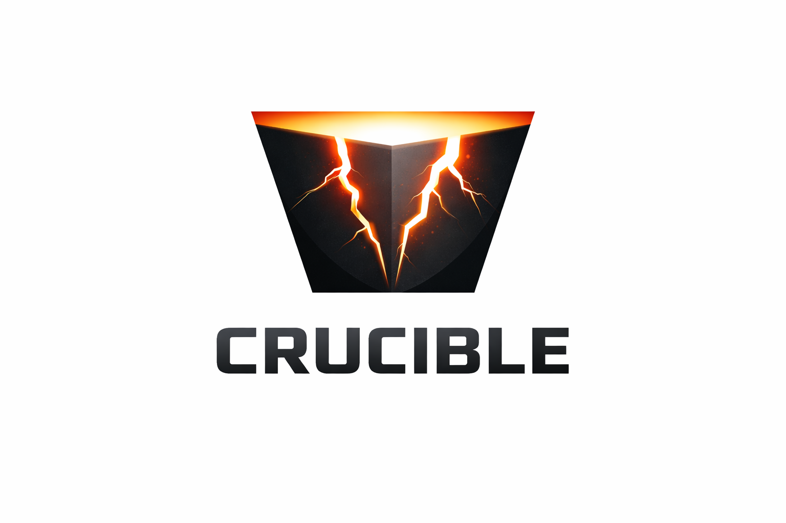

<p align="center">
  
</p>

<p align="center">
  <strong>Coverage-guided fuzzing framework for Solana smart contracts</strong>
</p>

<p align="center">
  Built on <a href="https://github.com/AFLplusplus/LibAFL">LibAFL</a> and <a href="https://github.com/LiteSVM/litesvm">LiteSVM</a> for fast, local transaction simulation with edge-level coverage tracking.
</p>

---

Crucible enables property-based testing and stateful invariant checking for Solana programs through randomly generated action sequences. Define your program's actions, write invariants, and let the fuzzer find violations automatically.

## Quick Start

### Install

```bash
cargo install crucible-fuzz-cli
```

### Initialize a fuzz harness

```bash
crucible init <program_name>
```

### Run a fuzz test

```bash
crucible run <program_name> <test_name> --release --timeout 60
```

---

## Documentation

| Topic | Description |
|-------|-------------|
| [Getting Started](docs/getting-started.md) | Setup, running, project structure, feature flags |
| [IDL Code Generation](docs/idl-gen.md) | Using `crucible-idl-gen` for standalone harnesses |
| [API Reference](docs/api-reference.md) | TestContext API — program loading, accounts, transactions, RPC cloning, time, oracles |
| [Writing Tests](docs/writing-tests.md) | Fixtures, actions, range constraints, simple & invariant fuzzing, assertion macros |
| [CLI Reference](docs/cli-reference.md) | All `crucible` commands and execution modes |
| [Crash Analysis](docs/crash-analysis.md) | Listing, viewing, replaying, and minimizing crashes |
| [Coverage Reports](docs/coverage.md) | Bytecode & source-level coverage, LCOV, genhtml |
| [Harness Guide](docs/harness-guide.md) | In-depth guide to writing effective fuzz harnesses |

---

For contributors and maintainers, see [CLAUDE.md](CLAUDE.md).
